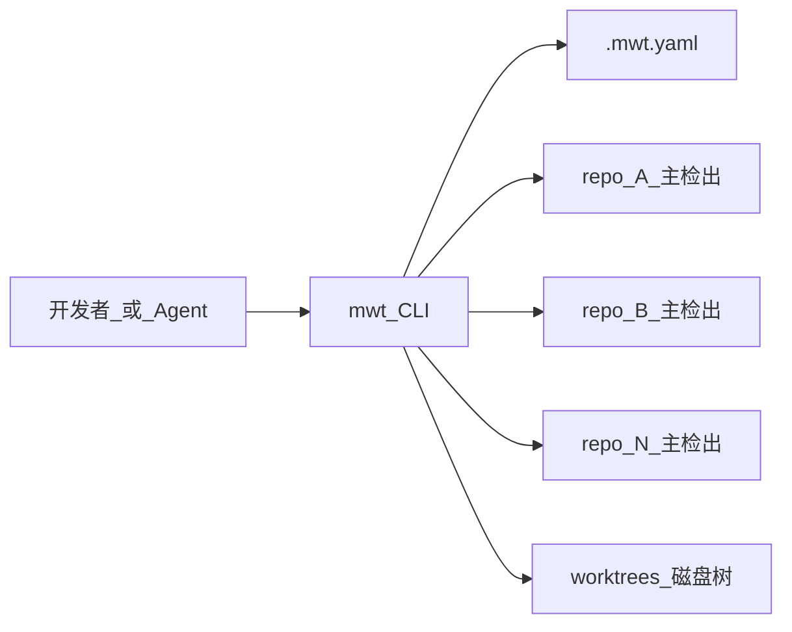
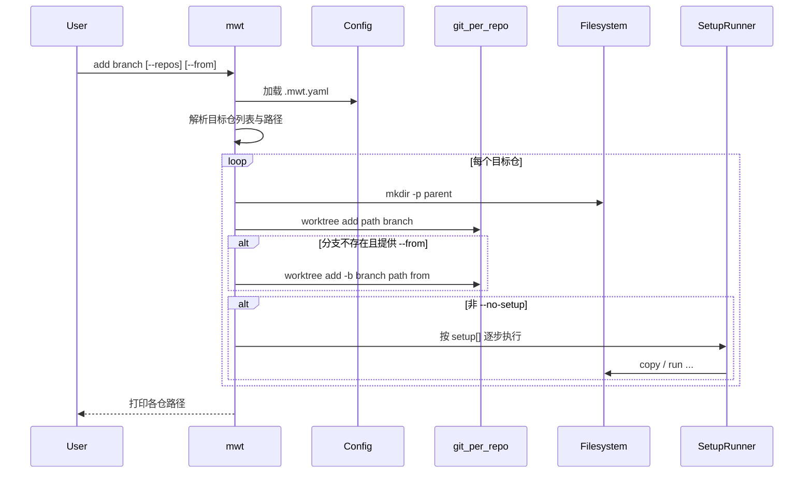

# mwt（Multi-repo WorkTrees）：多仓 Git Worktree 管理 CLI 技术方案

polyrepo 场景下需对多个独立 Git 仓做同逻辑分支联调，手工 `git worktree add` 易路径漂移、缺环境文件、出现 stale/prunable 注册。本文给出通用本地 CLI **mwt** 的技术方案；sync-auth（oauth / sap / org-sync）为首个配置实例，供实现与评审参考。

**命名契约：**

| 项 | 值 |
|----|-----|
| 命令 / 仓库短名 | `mwt` |
| 全称 | Multi-repo WorkTrees |
| 一句话 | polyrepo git worktree manager（CLI → TUI → agents） |
| 配置文件 | `.mwt.yaml` |
| 竞品锚点 | 类似 [workmux](https://github.com/raine/workmux)，差异在 **多独立仓 worktree set**，而非单仓 + tmux |

## 一、目标

**目标：** 提供通用 CLI，按元目录配置对 1～N 个独立 Git 仓批量创建 / 清理 / 巡检 worktree，并完成最小本地环境就绪。

**核心定位：**

- 元层编排器（非业务服务）：读配置 → 调 `git`（及可选语言工具）→ 写磁盘产物
- **多仓同分支为一等公民**：一次命令覆盖配置中的仓子集
- 配置驱动：任意元目录一份 `.mwt.yaml`，不写死 oauth/sap/org-sync
- 与 lazygit / workmux 分工：多仓联调走 mwt；单仓日常可用 lazygit；tmux 窗格编排非 v1 范围

**非目标（v1）：**

- 不替代 `git` / 不实现自研 VCS
- 不把多仓合并为单一 monorepo Git 根
- **不生成 `.code-workspace`**，无 `workspace` 子命令
- **不对接 Cursor Worktree**：不提供 `setup --here`、不读写 `.cursor/worktrees.json`、不依赖 `$ROOT_WORKTREE_PATH`
- 不自动打开 IDE 窗口、不自动建远程 PR
- 不绑定 tmux / WezTerm（与 workmux 核心叙事区分；后续可选）
- 不在 setup 中跑 DB migrate、全量测试、起中间件
- 不符号链接依赖目录到主检出（避免污染主工作区）
- **不嵌入使用方仓库**：不在 sync-auth 等目录维护 `tools/mwt`、不产出 `./bin/mwt`

**演进（非 v1 必做）：** TUI → AI Agent（按 Task/Workspace Set 派工）；能力后置，不改主名。

## 二、整体架构

### 2.1 架构概览



sync-auth 实例：`repos = oauth | org-sync | sap`。

### 2.2 核心组件说明

| 组件 | 职责 |
|------|------|
| CLI 入口（`cobra`） | 使用 [`github.com/spf13/cobra`](https://github.com/spf13/cobra) 定义根命令与子命令；定位元根（向上查找 `.mwt.yaml`）；分发到各命令 |
| Config（`.mwt.yaml`） | 仓库清单、路径模板、setup 开关；可提交，不含密钥 |
| GitAdapter（`os/exec` → `git`） | `worktree add/remove/list/prune`、分支探测；以各仓主检出为 `-C` 目标 |
| PathResolver | 按模板渲染 worktree 绝对路径 |
| SetupRunner | 按序执行通用 setup 步骤（`copy` / `run` 等）；步骤定义见配置 `setup` 列表 |
| Doctor | 对比磁盘与 `git worktree list`，报告缺失路径、未注册目录、缺环境文件 |

## 三、请求处理流程

> CLI 无网络请求链；以下为命令处理链。

### 3.1 标准命令时序（`add`）



### 3.2 处理链

```text
命令进入 mwt
--> 定位元根（向上找 .mwt.yaml）
--> 加载配置 / 校验 repos
--> 解析 --repos / branch / 标志位
--> 按仓串行执行 Git 操作（add 默认串行，避免并发 fetch）
--> SetupRunner（可选）
--> 写 stdout 摘要（路径、后续命令）
--> 非 0 退出码表示至少一仓失败（可用 --continue 尽量做完）
```

### 3.3 关键分支 / Failover

```text
git worktree add 失败？
--是--> 分支不存在？
          --是--> 提供了 --from？
                    --是--> add -b 新建分支后继续
                    --否--> 报错该仓，按 --continue 决定是否处理下一仓
          --否--> 路径已占用 / 其它 git 错误：报错该仓
--否--> 继续 setup

setup 某步 copy：to 已存在且 skip_if_exists？
--是--> 跳过该步
--否--> from 不存在且 skip_if_missing_src？
          --是--> 跳过该步
          --否--> 拷贝；失败则中止 setup（除非 --continue 策略另定）

setup 某步 run：command 非 0？
--是--> 中止该仓 setup，报错
--否--> 下一步

doctor 发现 list 路径不存在（prunable）？
--是--> 提示对该仓 git worktree prune，并给出按规范路径 re-add 命令
--否--> 继续其它检查项
```

## 四、安全与横切

本地开发工具，无服务端鉴权；重点防「密钥扩散」与「误删」。

### 4.1 分层防护

| 层级 | 措施 |
|------|------|
| 配置层 | `.mwt.yaml` 只含路径与开关，禁止写入密码 / Token |
| 文件层 | 仅按配置拷贝环境文件；不打印文件内容到日志 |
| 操作层 | `rm` 默认走 `git worktree remove`；危险清理需 `--force`；不实现 `rm -rf` 主检出 |
| 依赖层 | 不默认 symlink 主仓依赖目录 |

### 4.2 密钥与权限

- 环境文件来源仅限：各仓主检出，或元根 fallback
- worktree 内拷贝副本仍勿提交（依赖各仓 / 全局 gitignore）
- mwt 以当前用户权限调用本机 `git` 等，不提升权限

### 4.3 限流与配额

不适用服务端配额。长期 worktree 的磁盘占用由使用者通过 `mwt list` / `rm` / `doctor` 自行治理。

## 五、领域能力

### 5.1 多仓 Worktree 生命周期

| 命令 | 行为摘要 |
|------|----------|
| `init` | 从 cwd 向下扫描 Git 主检出（默认最多 10 层），生成 `.mwt.yaml`；按是否存在 `{cwd}/.git` **显式写入** `worktree_path`（§5.1 双默认）；命中仓后不下钻；跳过 `worktrees`/`.worktrees`；已存在需 `--force` |
| `skill sync` | 将二进制内嵌的 Agent 技能写出到 `~/.agents/skills/mwt`（`--dir` 改父目录；`--force` 覆盖；裸 `skill` 等同 sync） |
| `version` | 打印 mwt 二进制版本（ldflags / `runtime/debug`）；根命令亦支持 `--version` / `-v` |
| `add <branch>` | 对选定仓 `git worktree add`；可选 `--from` 建分支；默认跑 setup |
| `rm <branch>` | 对选定仓 `git worktree remove`；目录残留可 `--force` |
| `list` | 聚合配置内各仓 `git worktree list`，可按 `--branch` 过滤 |
| `path <branch> <repo>` | 打印绝对路径，供 Agent / 脚本 |

默认路径模板（可配置，占位符全大写）：

| 条件 | 缺省 `worktree_path` |
|------|----------------------|
| 元根存在 `{ROOT}/.git`（目录或 gitfile） | `.worktrees/{{REPO}}/{{BRANCH}}/{{REPO}}` |
| 元根不存在 `.git` | `worktrees/{{REPO}}/{{BRANCH}}/{{REPO}}` |

规则：

- 探测点：解析后的元根绝对路径下 `{ROOT}/.git`（`Stat` 存在即可；含普通仓目录与 linked worktree 的 gitfile）
- **仅**配置未写 `worktree_path` 时应用上表缺省；显式配置原样使用，**不**自动改写 `worktrees` ↔ `.worktrees`
- 动机：元根本身是 Git 仓时，用点目录便于 gitignore，减少污染主工作区视图

### 5.2 环境就绪（Setup）

抽象为**有序步骤列表** `setup:`，不再拆 `copy_env` / `env_files` / `commands` 等专用字段。

| 项 | 规则 |
|----|------|
| 触发 | `mwt add` 默认执行；`mwt setup <branch> [--repos ...]` 补跑；`--no-setup` 跳过 |
| 时机 | 该仓 worktree 路径已确定后，渲染占位符，再按序执行 |
| 工作目录 | `run` 默认 cwd = `{{WORKTREE_PATH}}` |
| 失败 | 任一步失败则该仓 setup 失败（退出非 0） |

v1 步骤类型见 §6.2；后续可扩展 `mkdir` / `link` 等而不改命令面。

### 5.3 巡检（Doctor）

| 检查项 | 输出建议 |
|--------|----------|
| `git worktree list` 路径不存在 | prune + 按模板 re-add |
| 磁盘有目录但未注册 | 引导正式 `add` 或清理脏目录 |
| 主检出目录不存在（`ROOT`/`repos` 项） | 配置或工作区布局错误提示 |
| （可选）setup 相关文件缺失 | 提示 `mwt setup <branch>`；不硬编码 `.env` |

### 5.4 与竞品分工

| 场景 | 工具 |
|------|------|
| 跨仓 / 长期同分支联调 | `mwt add` / `list` / `path` |
| 单仓 TUI 日常 | lazygit（无原生 setup） |
| 单仓 + tmux 并行 agent | workmux（竞品主场） |
| 历史树修复 | `mwt doctor` / `setup` |

与 workmux：

```text
workmux:  1 repo  × N branches  × tmux windows   (+ setup)
mwt:      N repos × 1 branch set × 编排(/TUI/Agent) (+ setup；tmux 可选后置)
```

## 六、数据模型要点

无数据库。持久化仅为本地文件：

| 产物 | 说明 | 关键内容 |
|------|------|----------|
| `.mwt.yaml` | 元根配置 | `repos[]`、`worktree_path`、`setup[]` |
| `worktrees/...` 或 `.worktrees/...` | 各仓独立 checkout（由模板渲染；缺省前缀见 §5.1） | 标准 Git worktree |
| 各仓 `.git` worktree 注册 | Git 元数据 | 与磁盘路径必须一致 |

配置字段草案：

| 字段 | 类型 | 说明 |
|------|------|------|
| `root` | string | 相对配置文件的元根，默认 `.` |
| `worktree_path` | string | 路径模板；仅可使用「路径阶段」占位符；**省略时**按 §5.1 依 `{ROOT}/.git` 选 `.worktrees/` 或 `worktrees/` 前缀 |
| `repos` | string[] | 主检出相对元根的路径列表（见下） |
| `setup` | list | 有序 setup 步骤；缺省或 `[]` 表示无 setup |

`repos` 形态（等价）：

```yaml
# 块序列
repos:
  - oauth
  - org-sync
  - sap

# 或 flow
repos: [oauth, org-sync, sap]
```

语义：每一项是相对 `root` 的主检出路径；同时作为该仓在模板中的 `{{REPO}}`（不再单独提供 `name` / `path` 对象）。若将来需要「展示名 ≠ 路径」，再扩展，v1 不支持。

### 6.1 占位符一览（全量）

约定：

- 形式：`{{NAME}}`，**NAME 全大写**，两侧双花括号，无空格
- 渲染：简单字符串替换（非 Go `text/template` 的 `{{.Field}}`）
- 未识别的 `{{...}}`：视为错误并失败（避免静默留下字面量）

| 占位符 | 含义 | 示例值（sync-auth / sap / `func_x`） |
|--------|------|--------------------------------------|
| `{{ROOT}}` | 元根绝对路径（解析 `.mwt.yaml` 所在元目录） | `/home/u/sync-auth` |
| `{{REPO}}` | 当前 `repos` 项（相对元根的主检出路径，配置原样） | `sap` |
| `{{REPO_PATH}}` | 与 `{{REPO}}` **相同**（别名，便于模板可读） | `sap` |
| `{{MAIN_PATH}}` | 主检出绝对路径（`ROOT` + `REPO`） | `/home/u/sync-auth/sap` |
| `{{BRANCH}}` | 目标分支名 | `func_x` |
| `{{WORKTREE_PATH}}` | 本仓 worktree 绝对路径（由 `worktree_path` 渲染并绝对化） | `/home/u/sync-auth/worktrees/sap/func_x/sap` |
| `{{WORKTREE_NAME}}` | worktree 目录 basename（`WORKTREE_PATH` 最后一段） | `sap` |

适用上下文：

| 占位符 | `worktree_path` | `setup` 步骤字段（`from`/`to`/`command`/`dir` 等） |
|--------|-----------------|-----------------------------------------------------|
| `{{ROOT}}` | 允许 | 允许 |
| `{{REPO}}` | 允许 | 允许 |
| `{{REPO_PATH}}` | 允许 | 允许 |
| `{{MAIN_PATH}}` | 允许 | 允许 |
| `{{BRANCH}}` | 允许 | 允许 |
| `{{WORKTREE_PATH}}` | **禁止**（尚未渲染完，避免自引用） | 允许 |
| `{{WORKTREE_NAME}}` | **禁止**（依赖 `WORKTREE_PATH`） | 允许 |

说明：

- `worktree_path` 只允许：`ROOT` / `REPO` / `REPO_PATH` / `MAIN_PATH` / `BRANCH`
- `setup` 在 worktree 路径已确定后渲染，可用上表全部占位符
- v1 **仅支持上表列出的占位符**；新增需改方案与实现并升版本说明

### 6.2 Setup 步骤模型（通用）

`setup` 为**步骤数组**，按顺序执行。每步是**单键对象**，键名为动作类型（便于扩展，避免一堆平铺布尔/列表字段）。

#### v1 动作类型

**1）`copy` — 文件拷贝**

```yaml
- copy:
    from: "{{MAIN_PATH}}/.env"
    to: "{{WORKTREE_PATH}}/.env"
    skip_if_exists: true        # 默认 true：目标已存在则跳过
    skip_if_missing_src: true   # 默认 true：源不存在则跳过（用于 fallback 链）
```

| 字段 | 必填 | 说明 |
|------|------|------|
| `from` | 是 | 源路径；可含占位符 |
| `to` | 是 | 目标路径；可含占位符 |
| `skip_if_exists` | 否 | 默认 `true` |
| `skip_if_missing_src` | 否 | 默认 `true` |

路径规则：占位符展开后，若为相对路径，则 `from` 相对 `{{ROOT}}`，`to` 相对 `{{WORKTREE_PATH}}`；已是绝对路径则不再拼接。

**2）`run` — 在指定目录执行命令**

```yaml
- run:
    command: "go mod download"
    dir: "{{WORKTREE_PATH}}"    # 可选，默认 {{WORKTREE_PATH}}
```

| 字段 | 必填 | 说明 |
|------|------|------|
| `command` | 是 | shell 命令串；可含占位符；经 `sh -c` 执行（实现可定为 `sh -c`） |
| `dir` | 否 | 工作目录；默认定 `{{WORKTREE_PATH}}` |

#### 扩展（非 v1）

后续可增加同级动作，例如 `mkdir`、`link`，无需改 CLI 子命令，只扩配置 schema。

#### 语义要点

- 空 `setup:` / 省略：不执行任何步骤
- 步骤之间无隐式「env 专用逻辑」：主检出优先再 fallback 由**两条 `copy` + `skip_*`** 表达
- 未知动作类型：配置校验失败

### 6.3 sync-auth 配置实例

sync-auth 元根通常**无**顶层 `.git`；下例显式写出 `worktree_path`（与缺省 `worktrees/...` 等价）。若省略该字段且元根存在 `.git`，则缺省变为 `.worktrees/{{REPO}}/{{BRANCH}}/{{REPO}}`（见 §5.1）。

```yaml
# sync-auth/.mwt.yaml
root: .
worktree_path: "worktrees/{{REPO}}/{{BRANCH}}/{{REPO}}"
repos:
  - oauth
  - org-sync
  - sap
# 等价写法: repos: [oauth, org-sync, sap]
setup:
  # 主检出有 .env 则拷入；已有则跳过
  - copy:
      from: "{{MAIN_PATH}}/.env"
      to: ".env"
      skip_if_exists: true
      skip_if_missing_src: true
  # 否则用元根示例占位
  - copy:
      from: "{{ROOT}}/.env.example"
      to: ".env"
      skip_if_exists: true
      skip_if_missing_src: true
  - run:
      command: "go mod download"
```

## 七、部署架构（可选）

### 7.1 交付形态

| 组件 | 说明 |
|------|------|
| 源码 | **独立 Git 仓库 / 独立 Go module**（不嵌入 sync-auth；不在 `sync-auth/tools/` 下开发） |
| 安装 | 标准 Go 分发：`go install github.com/Slothtron/mwt/cmd/mwt@latest`（或从源码 `go install ./cmd/mwt`）；二进制进 `$GOBIN`/`$GOPATH/bin`，由 PATH 调用 |
| 产物约定 | **不在使用方仓库生成 `./bin/mwt`**；sync-auth 等元目录只提交 `.mwt.yaml`，不提交 mwt 源码或构建产物 |
| 运行环境 | 开发者本机；依赖本机 `git`；`mwt` 已在 PATH |

### 7.2 网络与隔离

- 仅本机文件系统与本机 git remote
- 不引入新的网络监听端口

### 7.3 与使用方（如 sync-auth）的关系

```text
mwt 仓库（独立）          sync-auth（使用方，元根通常无 .git）
├── cmd/mwt | main.go     ├── .mwt.yaml          ← 唯一与 mwt 相关的约定文件
├── go.mod                ├── oauth|org-sync|sap/
└── README                └── worktrees/...      ← 无 .git 时缺省；有 .git 则缺省 .worktrees/
         │
         │  go install → PATH 上的 mwt
         └──────────────────► 在 sync-auth 根执行 mwt add|list|...
```

## 八、项目排期（可选）

| 阶段 | 范围 | 预估 |
|------|------|------|
| MVP | `.mwt.yaml` + add/rm/list/setup/path + 单测（路径/配置） | 待排期 |
| 增强 | doctor、文档 | 待排期 |
| 后续 | TUI；可选 tmux；AI Agent（Task / Workspace Set） | 待排期 |

**人力假设：** 未提供，不编造人周。

## 九、技术选型

| 方向 | 选型 | 理由 |
|------|------|------|
| 项目命名 | `mwt`（Multi-repo WorkTrees） | 短命令；通用不绑 sync-auth；避开 workmux/`wtmux` 撞名 |
| 实现语言 | Go | 子进程编排甜区；与常见 Go 业务仓同栈；避免为元工具强上 Rust |
| 对比备选 Rust | 不采用（v1） | 无长驻/热路径；交付速度优先 |
| Git 集成 | `os/exec` 调系统 `git` | 与本机 worktree 状态一致 |
| 配置格式 | YAML（`gopkg.in/yaml.v3`） | 人类可编辑 |
| CLI 框架 | [`github.com/spf13/cobra`](https://github.com/spf13/cobra) | 子命令 / flags / help 成熟；与常见 Go CLI 一致，便于后续扩展 |
| 路径约定 | 缺省双前缀：有 `{ROOT}/.git` → `.worktrees/...`，否则 `worktrees/...` | 占位符全大写；Git 元根用点目录便 gitignore；显式 `worktree_path` 优先 |
| IDE 产物 | 不生成 `.code-workspace`；不对接 Cursor Worktree | CLI 只管理 Git worktree；IDE 由用户自行打开路径 |
| 工程落点 | 独立仓库；`go install` 分发 | 通用工具不绑 sync-auth；使用方不产出 `./bin/mwt` |

## 十、风险与建议

| 风险 | 说明 | 缓解措施 |
|------|------|----------|
| 短名 `mwt` 零语义 | 外人不知全称 | README 固定全称与一句话定位 |
| 与 workmux 叙事重叠 | 都做 worktree + 后续 agent | 文档强调 polyrepo set；v1 不做 tmux |
| Git 注册路径与磁盘不一致 | 易出现 prunable | `doctor`；统一用 `mwt add` |
| 环境文件含口令 | 多树副本 | 仅拷不打印；gitignore；fallback 用 example |
| 部分仓 add 失败 | 联调不完整 | 非 0 退出；`--continue` + 摘要 |
| Agent 改错主检出 | 元根易写脏 | TASK 引用 `mwt path`；多仓任务强制 worktree 路径 |

---

## 附录 A：目录落点

**mwt 独立仓库（示意；元根有 `.git`，缺省 worktree 落在 `.worktrees/`）：**

```text
mwt/                         # 独立 Git 仓
├── .git/
├── go.mod
├── README.md
├── cmd/mwt/                 # 或根目录 main（实现时定）
└── .worktrees/              # 缺省（未配 worktree_path 时）
    └── {{REPO}}/{{BRANCH}}/{{REPO}}/
```

建议将 `.worktrees/` 写入该仓 `.gitignore`。

**使用方 sync-auth（仅配置与业务仓，无 mwt 源码/二进制；元根通常无 `.git` → 缺省 `worktrees/`）：**

```text
sync-auth/
├── .mwt.yaml                # 使用方配置
├── .env.example
├── oauth|org-sync|sap/
└── worktrees/
    └── {{REPO}}/{{BRANCH}}/{{REPO}}/   # 渲染后如 sap/func_xxx/sap
```

## 附录 B：MVP 验收命令（实现后）

```bash
# 在 mwt 独立仓库内安装到 PATH（示例）
cd /path/to/mwt && go install ./cmd/mwt

# 在使用方元目录验证
cd /path/to/sync-auth
mwt doctor
mwt add demo_mwt_smoke --repos sap --from master
mwt list --branch demo_mwt_smoke
mwt path demo_mwt_smoke sap
mwt rm demo_mwt_smoke --repos sap
```

## 附录 C：相关结论摘要

- 项目名：**mwt**（Multi-repo WorkTrees）；配置 **`.mwt.yaml`**
- 工程：**独立仓库**；`go install` 分发；**不在使用方生成 `./bin/mwt` 或嵌入 `tools/mwt`**
- 定位：通用 polyrepo worktree 编排；sync-auth 为配置实例
- 竞品：workmux（单仓+tmux）；mwt 押多仓同分支 set
- **不生成 `.code-workspace`**；**不对接 Cursor Worktree**
- 路径模板占位符全大写；全量见 §6.1
- **缺省路径前缀**：元根存在 `{ROOT}/.git` → `.worktrees/`，否则 `worktrees/`；显式 `worktree_path` 不改写（§5.1）
- setup：通用步骤列表（§6.2），v1 动作为 `copy` / `run`；无 `copy_env` 等专用字段
- `repos`：path 字符串数组（块序列或 `[a, b]`）；`{{REPO}}`/`{{REPO_PATH}}` 即该项
- CLI：`github.com/spf13/cobra`；含 `init`、`skill sync`（embed 技能 → `~/.agents/skills/mwt`）、`version`
- 语言：**Go**
- Agent 技能：源在 `internal/skilldata/mwt`（`go:embed`）；用户侧用 `mwt skill sync` 安装，不在仓内维护 `.agents/skills/mwt`
